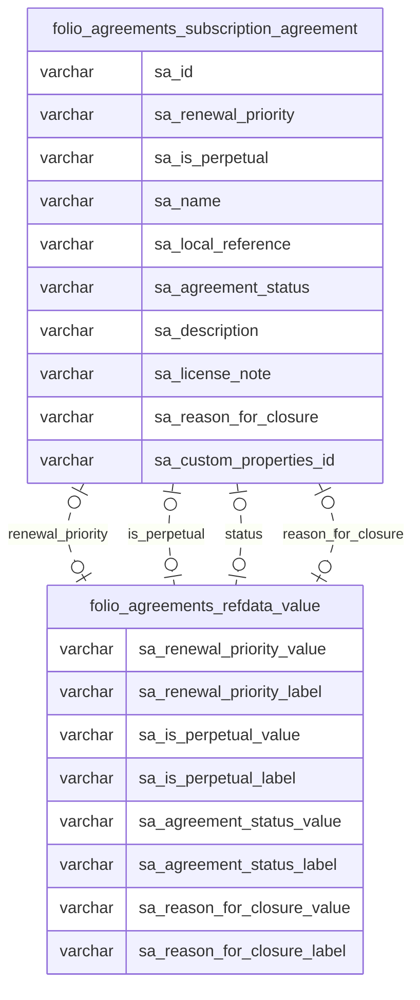

# Documentation: agreements_subscription_agreement.sql

## Attributes:

|   Attribute # | Attribute                   | Type   | Source - Schema   | Source - Table         | Source - Attribute      | Source - Type   | Source - Multiple values   | Aggregation   | Description                                                                                                                                                                                                                                              | Notes   |
|--------------:|:----------------------------|:-------|:------------------|:-----------------------|:------------------------|:----------------|:---------------------------|:--------------|:---------------------------------------------------------------------------------------------------------------------------------------------------------------------------------------------------------------------------------------------------------|:--------|
|             1 | sa_id                       | uuid   | folio_agreements  | subscription_agreement | sa_id                   | varchar         | no                         | no            | UUID of Agreement                                                                                                                                                                                                                                        | notes   |
|             2 | sa_renewal_priority         | uuid   | folio_agreements  | subscription_agreement | sa_renewal_priority     | varchar         | no                         | no            | ID of reference data value for renewal priority                                                                                                                                                                                                          | notes   |
|             3 | sa_renewal_priority_value   | text   | folio_agreements  | subscription_agreement | refdata_value_rdv_value | varchar         | no                         | no            | Describes whether an agreement should be renewed, reviewed or cancelled                                                                                                                                                                                  | notes   |
|             4 | sa_renewal_priority_label   | text   |                   |                        |                         |                 |                            |               | Displayed name of renewal priority                                                                                                                                                                                                                       |         |
|             5 | sa_is_perpetual             | uuid   |                   |                        |                         |                 |                            |               | ID of reference data value for is perpetual                                                                                                                                                                                                              |         |
|             6 | sa_is_perpetual_value       | text   |                   |                        |                         |                 |                            |               | Describes whether the agreement is a perpetual agreement or not                                                                                                                                                                                          |         |
|             7 | sa_is_perpetual_label       | text   |                   |                        |                         |                 |                            |               | Displayed name of is perpetual                                                                                                                                                                                                                           |         |
|             8 | sa_name                     | text   |                   |                        |                         |                 |                            |               | A name for the agreement assigned by the institution                                                                                                                                                                                                     |         |
|             9 | sa_local_reference          | text   |                   |                        |                         |                 |                            |               | Where an agreement has been created through an integration / data import from an external system the sa_local_reference is used to store a reference/identifier for the agreement in the external system to support ongoing data synchronisation/updates |         |
|            10 | sa_agreement_status         | uuid   |                   |                        |                         |                 |                            |               | ID of reference data value for agreement status                                                                                                                                                                                                          |         |
|            11 | sa_agreement_status_value   | text   |                   |                        |                         |                 |                            |               | Describes the current status of the agreement (e.g. Active, Closed)                                                                                                                                                                                      |         |
|            12 | sa_agreement_status_label   | text   |                   |                        |                         |                 |                            |               | Displayed name of agreement status                                                                                                                                                                                                                       |         |
|            13 | sa_description              | text   |                   |                        |                         |                 |                            |               | A description for the agreement assigned by the institution                                                                                                                                                                                              |         |
|            14 | sa_license_note             | text   |                   |                        |                         |                 |                            |               | To record any general information about the license for the Agreement                                                                                                                                                                                    |         |
|            15 | sa_reason_for_closure       | uuid   |                   |                        |                         |                 |                            |               | ID of reference data value for reason for closure                                                                                                                                                                                                        |         |
|            16 | sa_reason_for_closure_value | text   |                   |                        |                         |                 |                            |               | Describes for a closed agreement, the reason the agreement has been closed                                                                                                                                                                               |         |
|            17 | sa_reason_for_closure_label | text   |                   |                        |                         |                 |                            |               | Displayed name of reason for closure                                                                                                                                                                                                                     |         |
|            18 | sa_custom_properties_id     | int8   |                   |                        |                         |                 |                            |               | ID used to link custom_properties                                                                                                                                                                                                                        |         |

## ER diagram

